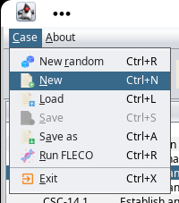
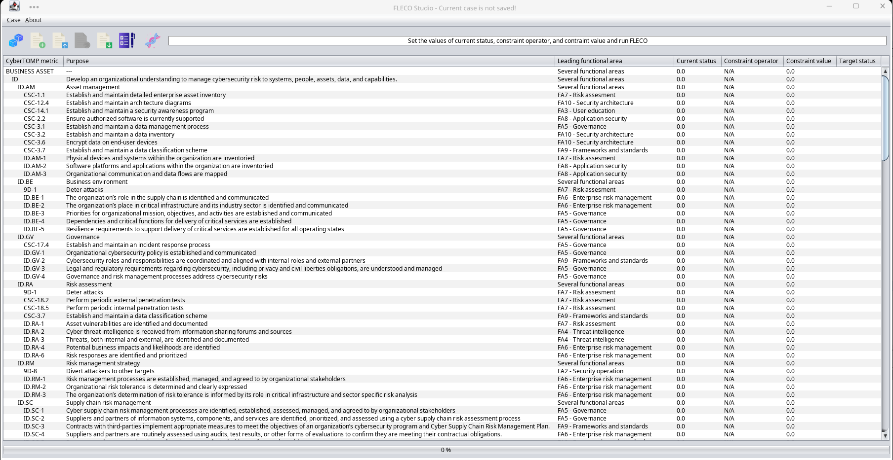

# PROJECT STATUS

## Master branch:


## Development branch:


# THE PROJECT

<b>FLECO</b> (Fast, Lightweight, and Efficient Cybersecurity Optimization) (1) Adaptive, Constrained, and Multi-objective Genetic Algorithm is a genetic algorithm designed to assist the Asset's Cybersecurity Committee (ACC) in making decisions during the application of CyberTOMP (2), aimed at managing comprehensive cybersecurity at both tactical and operational levels.

It serves as a library that can be seamlessly incorporated into larger solutions to facilitate testing. However, it is accompanied by FLECO Studio, a comprehensive GUI-based solution that is highly recommended for the committee responsible for selecting the necessary cybersecurity measures as defined in CyberTOMP. FLECO Studio enables this committee to conduct multiple simulations, preserve the current system state and the desired target state, load previously saved cases from storage, and seamlessly resume their work.

1. Domínguez-Dorado, M.; Cortés-Polo, D.; Carmona-Murillo, J.; Rodríguez-Pérez, F.J.; Galeano-Brajones, J. Fast, Lightweight, and Efficient Cybersecurity Optimization for Tactical–Operational Management. Appl. Sci. 2023, 13, 6327. https://doi.org/10.3390/app13106327
2. Dominguez-Dorado, M., Carmona-Murillo, J., Cortés-Polo, D., and Rodríguez-Pérez, F. J. (2022). CyberTOMP: A novel systematic framework to manage asset-focused cybersecurity from tactical and operational levels. IEEE Access, 10, 122454-122485. https://doi.org/10.1109/ACCESS.2022.3223440

# LICENSE

## Latest snapshot version being developed:

- <b>FLECO 1.3-SNAPSHOT</b> (develop branch) - LGPL-3.0-or-later.

## Binary releases:
 
- <b>FLECO 1.2</b> (current, master branch) - LGPL-3.0-or-later.
- <b>FLECO 1.1</b> LGPL-3.0-or-later.
- <b>FLECO 1.0</b> LGPL-3.0-or-later.

# PEOPLE BEHIND OPENSIMMPLS

## Author:
    
 - Manuel Domínguez-Dorado - <ingeniero@ManoloDominguez.com>
   
# COMPILING FROM SOURCES

The optimal course of action entails acquiring the most recent compiled stable releases from the releases section of this repository. Nevertheless, if one desires to assess novel functionalities, it becomes imperative to compile the project from its sources. The subsequent instructions outline the necessary steps to accomplish this task:

- Clone the FLECO repository: 

```console
git clone https://github.com/manolodd/fleco.git
```

- To obtain a binary JAR file containing all the necessary components, it is essential to compile the code. Prior to that, it is imperative to install Maven:

```console
cd fleco
mvn package
```

- The jar file will be located in "target" directory.

```console
cd target
```
- Now, run FLECO Studio:

```console
java -jar fleco-{YourVersion}-with-dependencies.jar

```
# THIRD-PARTY COMPONENTS

FLECO utilizes several third-party components, each of which is governed by its own open-source software (OSS) license. In order to ensure compliance with these licenses, thorough consideration has been given to enable the release of FLECO under its existing OSS license. The components integrated within FLECO encompass the following:

- miglayout-swing 11.1 - BSD-3-clause - https://github.com/mikaelgrev/miglayout
- miglayout-core 11.1 - BSD-3-clause - https://github.com/mikaelgrev/miglayout
- everit-json-schema 1.14.2 - Apache-2.0 - https://github.com/everit-org/json-schema

Thanks folks!

# USING FLECO IN JAVA LIBRARY MODE

Utilizing FLECO in library mode is remarkably straightforward. Begin by downloading the artifact and incorporating it into your project. Subsequently, adhere to the following instructions:

Specify the parameters for the the algorithm.

```java
// Number of potential solutions in the population
int initialPopulation = 30;  

// Seconds before stopping if no solutions are found
int maxSeconds = 5 * 60;  

// A standar crossover probability in the range [0.0f - 1.0f]
float crossoverProbability = 0.90f;  

// Select IG1, IG2, IG3 depending on whether the corresponding asset requires
// LOW, MEDIUM or HIGH cybersecurity.
ImplementationGroups implementationGroup = ImplementationGroups.IG3; 
```

Subsequently, proceed to generate and establish the current cybersecurity status of your asset based on the CyberTOMP proposal. It is essential to configure the value of each allele within the chromosomes individually to accurately reflect the anticipated outcome of your asset. This can be achieved by making sequential calls to the updateAllele(gene, allele) method. For example:

```java
Chromosome initialStatus = new Chromosome(implementationGroup);
initialStatus.updateAllele(Genes.PR_AC_PR_AC_3, Alleles.DLI_67);
initialStatus.updateAllele(Genes.PR_AC_PR_AC_4, Alleles.DLI_67);
initialStatus.updateAllele(Genes.PR_AC_PR_AC_5, Alleles.DLI_0);
initialStatus.updateAllele(Genes.PR_AC_PR_AC_7, Alleles.DLI_67);
initialStatus.updateAllele(Genes.PR_AT_PR_AT_1, Alleles.DLI_0);
initialStatus.updateAllele(Genes.PR_DS_CSC_3_4, Alleles.DLI_100);
initialStatus.updateAllele(Genes.PR_DS_PR_DS_3, Alleles.DLI_67);
initialStatus.updateAllele(Genes.PR_IP_9D_9, Alleles.DLI_0);
initialStatus.updateAllele(Genes.PR_IP_CSC_11_1, Alleles.DLI_100);
initialStatus.updateAllele(Genes.PR_IP_CSC_4_3, Alleles.DLI_100); 
```

And so on.

Continuing with the process, the subsequent step involves creating and defining the strategic cybersecurity goals and constraints. FLECO will strive to identify a new cybersecurity state, referred to as the "target state," which satisfies all of these goals. This will be achieved by starting from the current cybersecurity state, known as the "initial state," and determining the set of actions required to reach the target state. For example, a set of strategic goals could include:

```java
StrategicConstraints strategicConstraints = new StrategicConstraints(implementationGroup);
// Asset constraint
strategicConstraints.addConstraint(new Constraint(ComparisonOperators.GREATER, 0.65f));
// Functions constraints
strategicConstraints.addConstraint(Functions.IDENTIFY, new Constraint(ComparisonOperators.GREATER_OR_EQUAL, 0.6f));
// Category constraints
strategicConstraints.addConstraint(Categories.RC_CO, new Constraint(ComparisonOperators.LESS, 0.8f));
strategicConstraints.addConstraint(Categories.PR_AC, new Constraint(ComparisonOperators.GREATER, 0.6f));
strategicConstraints.addConstraint(Categories.ID_SC, new Constraint(ComparisonOperators.GREATER_OR_EQUAL, 0.5f));
// Expected outcomes constraints
strategicConstraints.addConstraint(Genes.RC_CO_RC_CO_3, new Constraint(ComparisonOperators.GREATER, 0.6f));
strategicConstraints.addConstraint(Genes.RS_MI_RS_MI_3, new Constraint(ComparisonOperators.GREATER_OR_EQUAL, 0.3f));
strategicConstraints.addConstraint(Genes.DE_DP_DE_DP_5, new Constraint(ComparisonOperators.EQUAL, 0.67f));
strategicConstraints.addConstraint(Genes.DE_AE_DE_AE_5, new Constraint(ComparisonOperators.LESS, 0.6f));
strategicConstraints.addConstraint(Genes.PR_PT_9D_7, new Constraint(ComparisonOperators.LESS_OR_EQUAL, 0.6f));
strategicConstraints.addConstraint(Genes.ID_BE_ID_BE_3, new Constraint(ComparisonOperators.GREATER_OR_EQUAL, 0.7f));
```
As demonstrated, these goals can be defined at various levels within the CyberTOMP's hierarchy of metrics.

Moving forward, instantiate the FLECO algorithm by initializing it with the aforementioned definitions.
        
```java
FLECO fleco;
fleco = new FLECO(initialPopulation, maxSeconds, crossoverProbability, implementationGroup, initialStatus, strategicConstraints);
```

To facilitate the monitoring of FLECO's execution progress, it is advisable to establish a default progress event listener. This listener is designed with the sole purpose of printing relevant information in the console, enabling continuous visibility into the ongoing operations of the algorithm.

```java
fleco.setProgressEventListener(new DefaultProgressEventListener());
```

Concludingly, invoking the "evolve()" method will initiate the operation of FLECO until a solution is discovered or the designated time period, specified as maxSeconds, elapses. Upon completion, the best chromosome can be retrieved, and its constituent genes can be printed for examination.

```java
fleco.evolve();
fleco.getBestChromosome().print();
```

The best chromosome obtained represents the target status, encompassing both its genes and their associated values. This set of cybersecurity actions exemplifies a high-quality collection that necessitates implementation to fulfill the strategic cybersecurity goals and constraints. In subsequent executions of FLECO with the same configuration, additional solutions, if they exist, may be discovered.

This example can be found in [SimpleExample.java](https://github.com/manolodd/fleco/blob/development/src/main/java/com/manolodominguez/experiments/SimpleExample.java)


# USING FLECO STUDIO (JAVA SWING STANDALONE APPLICATION MODE)

Utilizing FLECO Studio, the graphical user interface (GUI) version of FLECO, remains a more streamlined approach. Once the compilation process is complete, the subsequent step merely involves executing the following command:

```console
java -jar fleco-{YourVersion}-with-dependencies.jar
``` 

Upon execution, FLECO Studio will automatically launch, providing a user-friendly interface conveniently contained within a single window. To initiate a new case, simply navigate to the "Case" menu and select the "New" option.



Following the selection of the desired implementation group, a comprehensive table containing all the pertinent information is presented.



Modifiable data can be directly edited within the table by clicking on the corresponding cell. For instance, the initial status, referred to as the current status, should be adjusted to accurately reflect the actual cybersecurity status of each defined cybersecurity action in CyberTOMP, thereby representing the real status of the assets. Additionally, strategic constraints and goals can be defined using the "Constraint operator" and "Constraint value" columns. For example, consider the CyberTOMP metric "IDENTIFY" with a current status of "0.4." By selecting a constraint operator of "GREATER" and a constraint value of "0.8," FLECO is directed to seek a set of cybersecurity actions that collectively ensure the CyberTOMP metric "IDENTIFY" exceeds (strictly) 0.8.


